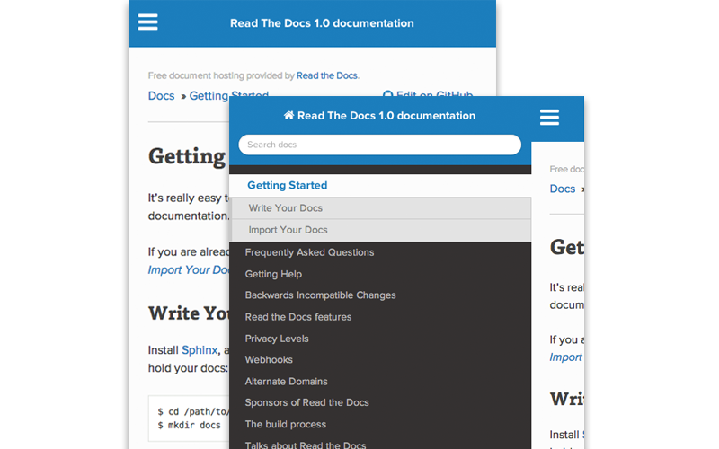

.. _readthedocs.org: http://www.readthedocs.org
.. _bower: http://www.bower.io
.. _sphinx: http://www.sphinx-doc.org
.. _compass: http://www.compass-style.org
.. _sass: http://www.sass-lang.com
.. _wyrm: http://www.github.com/snide/wyrm/
.. _grunt: http://www.gruntjs.com
.. _node: http://www.nodejs.com
.. _demo: http://docs.readthedocs.org

**************************
Read the Docs Sphinx Theme
**************************

View a working demo_ over on readthedocs.org_.

This is a prototype mobile-friendly sphinx_ theme I made for readthedocs.org_. It's
currently in development and includes some rtd variable checks that can be ignored
if you're just trying to use it on your project outside of that site.

Installation
============

Symlink or subtree the ``dist/sphinx_rtd_theme`` repository into your documentation at
``docs/_themes/sphinx_rtd_theme`` then add the following two settings to your Sphinx
conf.py file:

.. code-block::

    html_theme = "sphinx_rtd_theme"
    html_theme_path = ["_themes", ]

How the Table of Contents builds
================================

Currently the left menu will build based upon any ``toctree(s)`` defined in your index.rst file.
It outputs 2 levels of depth, which should give your visitors a high level of access to your
docs. If no toctrees are set the theme reverts to sphinx's usual local toctree.

It's important to note that if you don't follow the same styling for your rST headers across
your documents, the toctree will misbuild, and the resulting menu might not show the correct
depth when it renders.

Contributing or modifying the theme
===================================

The sphinx_rtd_theme is primarily a sass_ project that requires a few other sass libraries. I'm
using bower_ to manage these dependencies and compass_ to build the css. The good news is
I have a very nice set of grunt_ operations that will not only load these dependecies, but watch
for changes, rebuild the sphinx demo docs and build a distributable version of the theme in the ``dist``
directory. The bad news is this means you'll need to set up your environment similar to that
of a front-end developer (vs. that of a python developer). That means installing node and ruby.

Set up your environment
-----------------------

1. Install sphinx_ into a virtual environment.

.. code-block::

    pip install sphinx

2. Install sass and compass

.. code-block::

    gem install sass compass

2. Install node, bower and grunt.

.. code-block::

    // Install node
    brew install node

    // Install node package manager
    curl https://npmjs.org/install.sh | sh

    // Install bower and grunt
    npm install -g bower grunt-cli

Now that our environment is set up, make sure you're in your virtual environment, go to
this repository in your terminal and run grunt:

.. code-block::

    grunt

This default task will do the following **very cool things that make it worth the trouble**.

1. It'll install and update any bower dependencies.
2. It'll run sphinx and build new docs.
3. It'll watch for changes to the sass files and build css from the changes.
4. It'll rebuild the sphinx docs anytime it notices a change to .rst, .html, .js
   or .css files.

When you're done with your edits, you can run ``grunt dist`` to clean out the old
files and rebuild a new distribution, compressing the css and cleaning out
extraneous files.

Dude, come on, just for a theme?
-------------------------------------

Frontend development is quickly evolving to a package managed system with sane build tools
that are separate from the backend.

Working with a staticly generated system like sphinx is a pain in the ass for a designer because you
need to do so much rebuilding. Tools like grunt_ and sass_ really, really help make my life easier.
While I know you might be used to the simplicity of other sphinx themes that are just built
in CSS, the majority of the sphinx_rtd_theme comes from other libraries and I want to avoid
copy / pasting code in here just to build it.

OK fine, what files should I be editing then?
---------------------------------------------

Edit files in the ``src`` directory only. Primarily you'll want to edit the .html and .sass files.

TODO
====
* Update to font-awesome 4.0 and have it build from bower, not the copy/paste hack I have now.
* Separate some sass variables at the theme level so you can overwrite some basic colors.
* Add the ability to set a logo.
